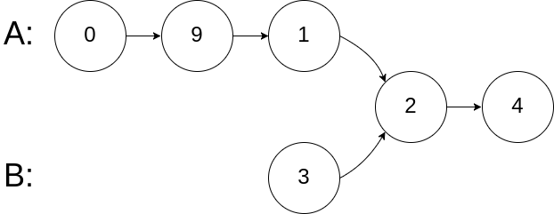

# 链表

#### [160. 相交链表](https://leetcode-cn.com/problems/intersection-of-two-linked-lists/)

难度：简单

给你两个单链表的头节点 `headA` 和 `headB` ，请你找出并返回两个单链表相交的起始节点。如果两个链表没有交点，返回 `null` 。

图示两个链表在节点 `c1` 开始相交**：**

[](https://assets.leetcode-cn.com/aliyun-lc-upload/uploads/2018/12/14/160_statement.png)

题目数据 **保证** 整个链式结构中不存在环。

**注意**，函数返回结果后，链表必须 **保持其原始结构** 。

 

**示例 1：**

[](https://assets.leetcode.com/uploads/2018/12/13/160_example_1.png)

```
输入：intersectVal = 8, listA = [4,1,8,4,5], listB = [5,0,1,8,4,5], skipA = 2, skipB = 3
输出：Intersected at '8'
解释：相交节点的值为 8 （注意，如果两个链表相交则不能为 0）。
从各自的表头开始算起，链表 A 为 [4,1,8,4,5]，链表 B 为 [5,0,1,8,4,5]。
在 A 中，相交节点前有 2 个节点；在 B 中，相交节点前有 3 个节点。
```

**示例 2：**

[](https://assets.leetcode.com/uploads/2018/12/13/160_example_2.png)

```
输入：intersectVal = 2, listA = [0,9,1,2,4], listB = [3,2,4], skipA = 3, skipB = 1
输出：Intersected at '2'
解释：相交节点的值为 2 （注意，如果两个链表相交则不能为 0）。
从各自的表头开始算起，链表 A 为 [0,9,1,2,4]，链表 B 为 [3,2,4]。
在 A 中，相交节点前有 3 个节点；在 B 中，相交节点前有 1 个节点。
```

**示例 3：**

[](https://assets.leetcode.com/uploads/2018/12/13/160_example_3.png)

```
输入：intersectVal = 0, listA = [2,6,4], listB = [1,5], skipA = 3, skipB = 2
输出：null
解释：从各自的表头开始算起，链表 A 为 [2,6,4]，链表 B 为 [1,5]。
由于这两个链表不相交，所以 intersectVal 必须为 0，而 skipA 和 skipB 可以是任意值。
这两个链表不相交，因此返回 null 。
```

 

**提示：**

- `listA` 中节点数目为 `m`
- `listB` 中节点数目为 `n`
- `0 <= m, n <= 3 * 104`
- `1 <= Node.val <= 105`
- `0 <= skipA <= m`
- `0 <= skipB <= n`
- 如果 `listA` 和 `listB` 没有交点，`intersectVal` 为 `0`
- 如果 `listA` 和 `listB` 有交点，`intersectVal == listA[skipA + 1] == listB[skipB + 1]`

 

**进阶：**你能否设计一个时间复杂度 `O(n)` 、仅用 `O(1)` 内存的解决方案？

**解析：**

参考链接：[图解相交链表 - 相交链表 - 力扣（LeetCode） (leetcode-cn.com)](https://leetcode-cn.com/problems/intersection-of-two-linked-lists/solution/tu-jie-xiang-jiao-lian-biao-by-user7208t/)

代码也很简单（此处代码是参考评论区的高手的）

```java
public ListNode getIntersectionNode(ListNode headA, ListNode headB) {
    if (headA == null || headB == null) return null;
//若相交，链表A： a+c, 链表B : b+c. a+c+b+c = b+c+a+c 。则会在公共处c起点相遇。若不相交，a +b = b+a 。
//题解：设链表A的长度为a+c，链表B的长度为b+c，a为链表A不公共部分，b为链表B不公共部分，c为链表A、B的公共部分,将两个链表连起来，A->B和B->A，长度：a+c+b+c=b+c+a+c，若链表AB相交，则a+c+b与b+c+a就会抵消，它们就会在c处相遇；若不相交，则c为nullptr，则a+b=b+a，它们各自移动到尾部循环结束，即返回nullptr
    
    ListNode pA = headA, pB = headB;
//当pA或pB为空时，它们开始指向另一链表的头部，每次判断pA或pB是否为空进行赋值的好处是当链表AB没有公共部分时pA和pB同时为空，这样避免了死循环  (也即遍历两遍)
    while (pA != pB) {
        pA = pA == null ? headB : pA.next;
        pB = pB == null ? headA : pB.next;
    }
    return pA;
}
```

复杂度分析

时间复杂度O(m+n)，其中 m 和 n 是分别是链表 headA 和headB 的长度。两个指针同时遍历两个链表，每个指针遍历两个链表各一次。

空间复杂度：O(1)。

#### [206. 反转链表](https://leetcode-cn.com/problems/reverse-linked-list/)

难度简单1845

给你单链表的头节点 `head` ，请你反转链表，并返回反转后的链表。

 

**示例 1：**


```
输入：head = [1,2,3,4,5]
输出：[5,4,3,2,1]
```

**示例 2：**


```
输入：head = [1,2]
输出：[2,1]
```

**示例 3：**

```
输入：head = []
输出：[]
```

 

**提示：**

- 链表中节点的数目范围是 `[0, 5000]`
- `-5000 <= Node.val <= 5000`

 

**进阶：**链表可以选用迭代或递归方式完成反转。你能否用两种方法解决这道题？

**解析：**

原作者链接：[动画演示+多种解法 206. 反转链表 - 反转链表 - 力扣（LeetCode） (leetcode-cn.com)](https://leetcode-cn.com/problems/reverse-linked-list/solution/dong-hua-yan-shi-206-fan-zhuan-lian-biao-by-user74/)

代码实现：

```java
class Solution {
	public ListNode reverseList(ListNode head) {
		//申请节点，pre和 cur，pre指向null
		ListNode pre = null;
		ListNode cur = head;
		ListNode tmp = null;
		while(cur!=null) {
			//记录当前节点的下一个节点
			tmp = cur.next;
			//然后将当前节点指向pre
			cur.next = pre;
			//pre和cur节点都前进一位
			pre = cur;
			cur = tmp;
		}
		return pre;
	}
}
```

**递归解法**

代码实现：

```
//解释
reverseList: head=1
    reverseList: head=2
	    reverseList: head=3
		    reverseList:head=4
			    reverseList:head=5 
					终止返回
				cur = 5
				4.next.next->4，即5->4
			cur=5
			3.next.next->3，即4->3
		cur = 5
		2.next.next->2，即3->2
	cur = 5
	1.next.next->1，即2->1
	
	最后返回cur
```

```java
class Solution {
	public ListNode reverseList(ListNode head) {
		//递归终止条件是当前为空，或者下一个节点为空
		if(head==null || head.next==null) {
			return head;
		}
		//这里的cur就是最后一个节点
		ListNode cur = reverseList(head.next);
		//这里请配合动画演示理解
		//如果链表是 1->2->3->4->5，那么此时的cur就是5
		//而head是4，head的下一个是5，下下一个是空
		//所以head.next.next 就是5->4
		head.next.next = head;
		//防止链表循环，需要将head.next设置为空
		head.next = null;
		//每层递归函数都返回cur，也就是最后一个节点
		return cur;
	}
}
```

#### [21. 合并两个有序链表](https://leetcode-cn.com/problems/merge-two-sorted-lists/)

难度简单

将两个升序链表合并为一个新的 **升序** 链表并返回。新链表是通过拼接给定的两个链表的所有节点组成的。 

 

**示例 1：**


```
输入：l1 = [1,2,4], l2 = [1,3,4]
输出：[1,1,2,3,4,4]
```

**示例 2：**

```
输入：l1 = [], l2 = []
输出：[]
```

**示例 3：**

```
输入：l1 = [], l2 = [0]
输出：[0]
```

 

**提示：**

- 两个链表的节点数目范围是 `[0, 50]`
- `-100 <= Node.val <= 100`
- `l1` 和 `l2` 均按 **非递减顺序** 排列

**解析：**解题链接：[合并两个有序链表 - 合并两个有序链表 - 力扣（LeetCode） (leetcode-cn.com)](https://leetcode-cn.com/problems/merge-two-sorted-lists/solution/he-bing-liang-ge-you-xu-lian-biao-by-leetcode-solu/)

**递归：**

```java
解释：//(1,1):代表第一次进入递归函数，并且从第一个口进入，并且记录进入前链表的状态
merge(1,1): 1->4->5->null, 1->2->3->6->null
    merge(2,2): 4->5->null, 1->2->3->6->null
    	merge(3,2): 4->5->null, 2->3->6->null
    		merge(4,2): 4->5->null, 3->6->null
    			merge(5,1): 4->5->null, 6->null
    				merge(6,1): 5->null, 6->null
    					merge(7): null, 6->null
    					return l2
    				l1.next --- 5->6->null, return l1
    			l1.next --- 4->5->6->null, return l1
    		l2.next --- 3->4->5->6->null, return l2
    	l2.next --- 2->3->4->5->6->null, return l2
    l2.next --- 1->2->3->4->5->6->null, return l2
l1.next --- 1->1->2->3->4->5->6->null, return l1
```

```java
class Solution {
    public ListNode mergeTwoLists(ListNode l1, ListNode l2) {
        if (l1 == null) {
            return l2;
        } else if (l2 == null) {
            return l1;
        } else if (l1.val < l2.val) {
            l1.next = mergeTwoLists(l1.next, l2);
            return l1;
        } else {
            l2.next = mergeTwoLists(l1, l2.next);
            return l2;
        }

    }
}

```

**复杂度分析**

- 时间复杂度：O(n+m)，其中 n 和 m 分别为两个链表的长度。因为每次调用递归都会去掉 l1 或者 l2 的头节点（直到至少有一个链表为空），函数 mergeTwoList 至多只会递归调用每个节点一次。因此，时间复杂度取决于合并后的链表长度，即O(n+m)。

- 空间复杂度：O(n+m)，其中 n 和 m 分别为两个链表的长度。递归调用 mergeTwoLists 函数时需要消耗栈空间，栈空间的大小取决于递归调用的深度。结束递归调用时 mergeTwoLists 函数最多调用 n+m 次，因此空间复杂度为O(n+m)。


**迭代：**


```java
class Solution {
    public ListNode mergeTwoLists(ListNode l1, ListNode l2) {
        ListNode prehead = new ListNode(-1)//新建哑节点（伪头节点），值为-1，哑节点不是头节点，是新造的一个伪头节点，但是它存储的地址和头节点一样

        ListNode prev = prehead;//之所以赋值给prev  这里prev可以当作游标往后移动，否则最后返回prev就不对
        while (l1 != null && l2 != null) {
            if (l1.val <= l2.val) {
                prev.next = l1;
                l1 = l1.next;
            } else {
                prev.next = l2;
                l2 = l2.next;
            }
            prev = prev.next;
        }

        // 合并后 l1 和 l2 最多只有一个还未被合并完，我们直接将链表末尾指向未合并完的链表即可
        prev.next = l1 == null ? l2 : l1;

        return prehead.next;//下一节点地址。相当于头节点 
    }
}

```

复杂度分析

时间复杂度：O(n+m)，其中 n 和 m 分别为两个链表的长度。因为每次循环迭代中，l1 和 l2 只有一个元素会被放进合并链表中， 因此 while 循环的次数不会超过两个链表的长度之和。所有其他操作的时间复杂度都是常数级别的，因此总的时间复杂度为 O(n+m)。

空间复杂度：O(1)。我们只需要常数的空间存放若干变量。

#### [83. 删除排序链表中的重复元素](https://leetcode-cn.com/problems/remove-duplicates-from-sorted-list/)

难度简单608

存在一个按升序排列的链表，给你这个链表的头节点 `head` ，请你删除所有重复的元素，使每个元素 **只出现一次** 。

返回同样按升序排列的结果链表。

 

**示例 1：**


```
输入：head = [1,1,2]
输出：[1,2]
```

**示例 2：**


```
输入：head = [1,1,2,3,3]
输出：[1,2,3]
```

 

**提示：**

- 链表中节点数目在范围 `[0, 300]` 内
- `-100 <= Node.val <= 100`
- 题目数据保证链表已经按升序排列

**解析：**

**递归**

```java
/**
 * Definition for singly-linked list.
 * public class ListNode {
 *     int val;
 *     ListNode next;
 *     ListNode() {}
 *     ListNode(int val) { this.val = val; }
 *     ListNode(int val, ListNode next) { this.val = val; this.next = next; }
 * }
 */
class Solution {
    public ListNode deleteDuplicates(ListNode head) {
        if(head == null || head.next==null) return head;
        head.next = deleteDuplicates(head.next);
        return  head.val == head.next.val ? head.next:head;       
    }
}
```

**解析：**

参考链接：[画解算法：83. 删除排序链表中的重复元素 - 删除排序链表中的重复元素 - 力扣（LeetCode） (leetcode-cn.com)](https://leetcode-cn.com/problems/remove-duplicates-from-sorted-list/solution/hua-jie-suan-fa-83-shan-chu-pai-xu-lian-biao-zhong/)

**思路**

- 标签：链表
- 指定 cur 指针指向头部 head
- 当 cur 和 cur.next 的存在为循环结束条件，当二者有一个不存在时说明链表没有去重复的必要了
- 当 cur.val 和 cur.next.val 相等时说明需要去重，则将 cur 的下一个指针指向下一个的下一个，这样就能达到去重复的效果
- 如果不相等则 cur 移动到下一个位置继续循环
- 时间复杂度：*O*(*n*)

**代码**

```
/**
 * Definition for singly-linked list.
 * public class ListNode {
 *     int val;
 *     ListNode next;
 *     ListNode(int x) { val = x; }
 * }
 */
class Solution {
    public ListNode deleteDuplicates(ListNode head) {        
        ListNode cur = head;
        while(cur != null && cur.next != null) {//因为测试的时候的链表可能给的[] 所以cur!=null的判定也要给上~
            if(cur.val == cur.next.val) {
                //因为是升序排列 所以也只可能是挨着的二位相同辽~
                cur.next = cur.next.next;//删除重复的辣个cur.next
            }
            else {
                cur = cur.next;//cur继续前移
            }
        }
        return head;//返回结果链表
    }
}
```

**复杂度分析**

- 时间复杂度：*O*(*n*)，其中 *n* 是链表的长度。
- 空间复杂度：*O*(1)。

#### [19. 删除链表的倒数第 N 个结点](https://leetcode-cn.com/problems/remove-nth-node-from-end-of-list/)

难度中等1457

给你一个链表，删除链表的倒数第 `n` 个结点，并且返回链表的头结点。

**进阶：**你能尝试使用一趟扫描实现吗？

 

**示例 1：**


```
输入：head = [1,2,3,4,5], n = 2
输出：[1,2,3,5]
```

**示例 2：**

```
输入：head = [1], n = 1
输出：[]
```

**示例 3：**

```
输入：head = [1,2], n = 1
输出：[1]
```

 

**提示：**

- 链表中结点的数目为 `sz`
- `1 <= sz <= 30`
- `0 <= Node.val <= 100`
- `1 <= n <= sz`

**解析：**

参考链接：[删除链表的倒数第N个节点 - 删除链表的倒数第 N 个结点 - 力扣（LeetCode） (leetcode-cn.com)](https://leetcode-cn.com/problems/remove-nth-node-from-end-of-list/solution/shan-chu-lian-biao-de-dao-shu-di-nge-jie-dian-b-61/)

**官方代码：**

```java
class Solution {
    public ListNode removeNthFromEnd(ListNode head, int n) {
        ListNode dummy = new ListNode(0, head);
        ListNode first = head;
        ListNode second = dummy;
        for (int i = 0; i < n; ++i) {
            first = first.next;
        }
        while (first != null) {
            first = first.next;
            second = second.next;
        }
        second.next = second.next.next;
        ListNode ans = dummy.next;
        return ans;
    }
}
因为要删除该节点，所以要移动到该节点的前一个才能删除，所以循环结束条件为 start.next != null
```

**自己代码：**

```java
/**
 * Definition for singly-linked list.
 * public class ListNode {
 *     int val;
 *     ListNode next;
 *     ListNode() {}
 *     ListNode(int val) { this.val = val; }
 *     ListNode(int val, ListNode next) { this.val = val; this.next = next; }
 * }
 */
class Solution {
    public ListNode removeNthFromEnd(ListNode head, int n) {
        ListNode fast = head;
        while(n-- >0){
            fast = fast.next;

        }
        if(fast == null)  return head.next;//如果fast == null  说明fast经过以为遍历到了最后一个节点的后一位，此时n = 链表长度，说明要删除的是第一个节点。
        ListNode slow = head;
        while(fast.next != null){//因为要删除该节点，所以要移动到该节点的前一个才能删除，所以循环结束条件为 fast.next != null
            fast = fast.next;
            slow = slow.next;
        }
        slow.next = slow.next.next;
        return head;
    }
}
```

**复杂度分析**

- 时间复杂度：*O*(*L*)，其中 *L* 是链表的长度。
- 空间复杂度：*O*(1)。

#### [24. 两两交换链表中的节点](https://leetcode-cn.com/problems/swap-nodes-in-pairs/)

难度中等973

给定一个链表，两两交换其中相邻的节点，并返回交换后的链表。

**你不能只是单纯的改变节点内部的值**，而是需要实际的进行节点交换。

 

**示例 1：**


```
输入：head = [1,2,3,4]
输出：[2,1,4,3]
```

**示例 2：**

```
输入：head = []
输出：[]
```

**示例 3：**

```
输入：head = [1]
输出：[1]
```

 

**提示：**

- 链表中节点的数目在范围 `[0, 100]` 内
- `0 <= Node.val <= 100`

 

**进阶：**你能在不修改链表节点值的情况下解决这个问题吗?（也就是说，仅修改节点本身。）

**解析：**

**方法二：迭代**

**思路与算法**

也可以通过迭代的方式实现两两交换链表中的节点。

创建哑结点 `dummyHead`，令 `dummyHead.next = head`。令 `temp` 表示当前到达的节点，初始时 `temp = dummyHead`。每次需要交换 `temp` 后面的两个节点。

如果 `temp` 的后面没有节点或者只有一个节点，则没有更多的节点需要交换，因此结束交换。否则，获得 `temp` 后面的两个节点 `node1` 和 `node2`，通过更新节点的指针关系实现两两交换节点。

具体而言，交换之前的节点关系是 `temp -> node1 -> node2`，交换之后的节点关系要变成 `temp -> node2 -> node1`，因此需要进行如下操作。

```
temp.next = node2
node1.next = node2.next
node2.next = node1
```

完成上述操作之后，节点关系即变成 `temp -> node2 -> node1`。再令 `temp = node1`，对链表中的其余节点进行两两交换，直到全部节点都被两两交换。

两两交换链表中的节点之后，新的链表的头节点是 `dummyHead.next`，返回新的链表的头节点即可。


**代码**

```
class Solution {
    public ListNode swapPairs(ListNode head) {
        ListNode dummyHead = new ListNode(0);//创建一个头节点
        dummyHead.next = head;
        ListNode temp = dummyHead;
        while (temp.next != null && temp.next.next != null) {
            ListNode node1 = temp.next;
            ListNode node2 = temp.next.next;
            temp.next = node2;
            node1.next = node2.next;
            node2.next = node1;
            temp = node1;
        }
        return dummyHead.next;
    }
}
```

**复杂度分析**

- 时间复杂度：*O*(*n*)，其中 *n* 是链表的节点数量。需要对每个节点进行更新指针的操作。
- 空间复杂度：*O*(1)。

#### [445. 两数相加 II](https://leetcode-cn.com/problems/add-two-numbers-ii/)

难度中等

给你两个 **非空** 链表来代表两个非负整数。数字最高位位于链表开始位置。它们的每个节点只存储一位数字。将这两数相加会返回一个新的链表。

你可以假设除了数字 0 之外，这两个数字都不会以零开头。

 

**示例1：**


```
输入：l1 = [7,2,4,3], l2 = [5,6,4]
输出：[7,8,0,7]
```

**示例2：**

```
输入：l1 = [2,4,3], l2 = [5,6,4]
输出：[8,0,7]
```

**示例3：**

```
输入：l1 = [0], l2 = [0]
输出：[0]
```

 

**提示：**

- 链表的长度范围为` [1, 100]`
- `0 <= node.val <= 9`
- 输入数据保证链表代表的数字无前导 0

 

**进阶：**如果输入链表不能修改该如何处理？换句话说，不能对列表中的节点进行翻转。

**解析：**

参考链接：[【画图分析】445 题 两数相加 II - 两数相加 II - 力扣（LeetCode） (leetcode-cn.com)](https://leetcode-cn.com/problems/add-two-numbers-ii/solution/hua-tu-fen-xi-445-ti-liang-shu-xiang-jia-ghb1/)

这道题可以通过使用栈来解决，我们需要构建两个栈，将两个链表中的值分别压入这两个栈中。


每次都从两个栈中各弹出一个元素，就是我们所需要的最末位元素，按照计算方式，相加取模求当前位的值，同时我们还需要记录当前位的进位。最后，我们使用获得的值，构建一个节点。


我们需要使用一个指针作为头指针，指向当前节点。每次新增节点，我们只需要将新节点插入到头指针之后即可。


```java
/**
 * Definition for singly-linked list.
 * public class ListNode {
 *     int val;
 *     ListNode next;
 *     ListNode() {}
 *     ListNode(int val) { this.val = val; }
 *     ListNode(int val, ListNode next) { this.val = val; this.next = next; }
 * }
 */
class Solution {
    public ListNode addTwoNumbers(ListNode l1, ListNode l2) {
        Deque<Integer> stack1  =  new LinkedList<>();
        Deque<Integer> stack2  =  new LinkedList<>();
        while(l1 != null){
            stack1.push(l1.val);
            l1 = l1.next;
        }
        while(l2 != null){
            stack2.push(l2.val);
            l2 = l2.next;
        }
        ListNode head = new ListNode(-1);//创建一个头节点
        int carry =0;//存储进位
        while(!stack1.isEmpty() || !stack2.isEmpty() || carry!=0){
            int x = stack1.isEmpty() ? 0:stack1.pop();
            int y = stack2.isEmpty() ? 0:stack2.pop();
            int sum  = x + y + carry;
            carry = sum /10;
            ListNode tmp =new ListNode(sum %10);

            tmp.next = head.next;//把当前节点的下一节点指向头节点的下一个节点          
            head.next = tmp;//再把当前节点 变为头节点下一节点   
        }
        return head.next;
    }
}
```

```java
 //通过栈的形式：实现两个链表相加
    public ListNode addTwoNumbers(ListNode l1, ListNode l2) {
        //创建两个栈：存放两个链表的value
        Stack<Integer> stack1 = new Stack<>();      //存放l1的value
        Stack<Integer> stack2 = new Stack<>();      //存放l2的value
        //创建一个：指向null的结点
        ListNode head = null;           

        //将l1的value放入：stack1
        while(l1 != null){
            stack1.push(l1.val);
            l1 = l1.next;
        }

        //将l2的value放入：stack2
        while(l2 != null){
            stack2.push(l2.val);
            l2 = l2.next;
        }

        //自定义：循环变量
        int carry = 0;               //记录：来自低位的进位
        int num = 0;                 //记录两个链表相加的：value值
        ListNode newNode = null;    //用于记录：新链表，创建的结点

        //循环判断
        while(!stack1.empty() || !stack2.empty() || carry > 0){
            //循环体
            num = carry;           //记录来自：低位的进位， 如果没有，则为0，否则为1
            num += stack1.empty() ? 0:stack1.pop();     //加上l1的栈顶value
            num += stack2.empty() ? 0:stack2.pop();     //加上l2的栈顶value

            //改变变量
            newNode = new ListNode(num%10);
            //利用头插法：插入到新链表
            newNode.next = head;                        //指向第一个有效结点
            head = newNode;                             //第一个有效结点：向前移动
            carry = num/10;                              //记录：进位
        }
      return head;
    }
```


#### [234. 回文链表](https://leetcode-cn.com/problems/palindrome-linked-list/)

难度：简单

请判断一个链表是否为回文链表。

**示例 1:**

```
输入: 1->2
输出: false
```

**示例 2:**

```
输入: 1->2->2->1
输出: true
```

**进阶：**
你能否用 O(n) 时间复杂度和 O(1) 空间复杂度解决此题？

**方法三：快慢指针**
**思路**

避免使用 O(n) 额外空间的方法就是改变输入。

我们可以将链表的后半部分反转（修改链表结构），然后将前半部分和后半部分进行比较。比较完成后我们应该将链表恢复原样。虽然不需要恢复也能通过测试用例，但是使用该函数的人通常不希望链表结构被更改。

该方法虽然可以将空间复杂度降到 O(1)，但是在并发环境下，该方法也有缺点。在并发环境下，函数运行时需要锁定其他线程或进程对链表的访问，因为在函数执行过程中链表会被修改。

**算法**

整个流程可以分为以下五个步骤：

1. 找到前半部分链表的尾节点。
2. 反转后半部分链表。
3. 判断是否回文。
4. 恢复链表。
5. 返回结果。

执行步骤一，我们可以计算链表节点的数量，然后遍历链表找到前半部分的尾节点。

我们也可以使用快慢指针在一次遍历中找到：慢指针一次走一步，快指针一次走两步，快慢指针同时出发。当快指针移动到链表的末尾时，慢指针恰好到链表的中间。通过慢指针将链表分为两部分。

若链表有奇数个节点，则中间的节点应该看作是前半部分。

步骤二可以使用「206. 反转链表」问题中的解决方法来反转链表的后半部分。

步骤三比较两个部分的值，当后半部分到达末尾则比较完成，可以忽略计数情况中的中间节点。

步骤四与步骤二使用的函数相同，再反转一次恢复链表本身。


```java
/**
 * Definition for singly-linked list.
 * public class ListNode {
 *     int val;
 *     ListNode next;
 *     ListNode() {}
 *     ListNode(int val) { this.val = val; }
 *     ListNode(int val, ListNode next) { this.val = val; this.next = next; }
 * }
 */
class Solution {
    public boolean isPalindrome(ListNode head) {
        if(head == null) return true;

        //找到前半部分链表的尾节点并反转后半部分链表
        ListNode firstHalfEnd = endOfFirstHalf(head);
        ListNode secondHalfStart = reverseList(firstHalfEnd.next);
       
       //判断是否回文
        ListNode p1 = head;
        ListNode p2 = secondHalfStart;
        boolean result = true;
        while(result && p2 != null){ //因为链表奇数点时，奇数点属于前一链表，所以后半部分总比前半部分少, 所以判断p2是否等于null
        if(p1.val != p2.val){
            result =false;
        }
        p1 = p1.next;
        p2 = p2.next;

        }
        //还原链表并返回结果
        firstHalfEnd.next = reverseList(secondHalfStart);
        return result;
    }
    public ListNode endOfFirstHalf(ListNode head){
        ListNode fast =head,slow = head;
        while(fast.next != null && fast.next.next != null){
            fast = fast.next.next;
            slow = slow.next;
        }
        return slow;
    }
    public  ListNode reverseList(ListNode head){
        ListNode newHead = null;//新建的一个头节点
        while(head != null){
            ListNode temNode = head.next;
            head.next = newHead;
            newHead = head;
            head = temNode;
        }
        return newHead;
    } 
}
```

**复杂度分析**

时间复杂度：O(n)，其中 n 指的是链表的大小。

空间复杂度：O(1)。我们只会修改原本链表中节点的指向，而在堆栈上的堆栈帧不超过 O(1)。

#### [725. 分隔链表](https://leetcode-cn.com/problems/split-linked-list-in-parts/)

难度中等146

给定一个头结点为 `root` 的链表, 编写一个函数以将链表分隔为 `k` 个连续的部分。

每部分的长度应该尽可能的相等: 任意两部分的长度差距不能超过 1，也就是说可能有些部分为 null。

这k个部分应该按照在链表中出现的顺序进行输出，并且排在前面的部分的长度应该大于或等于后面的长度。

返回一个符合上述规则的链表的列表。

举例： 1->2->3->4, k = 5 // 5 结果 [ [1], [2], [3], [4], null ]

**示例 1：**

```
输入: 
root = [1, 2, 3], k = 5
输出: [[1],[2],[3],[],[]]
解释:
输入输出各部分都应该是链表，而不是数组。
例如, 输入的结点 root 的 val= 1, root.next.val = 2, \root.next.next.val = 3, 且 root.next.next.next = null。
第一个输出 output[0] 是 output[0].val = 1, output[0].next = null。
最后一个元素 output[4] 为 null, 它代表了最后一个部分为空链表。
```

**示例 2：**

```
输入: 
root = [1, 2, 3, 4, 5, 6, 7, 8, 9, 10], k = 3
输出: [[1, 2, 3, 4], [5, 6, 7], [8, 9, 10]]
解释:
输入被分成了几个连续的部分，并且每部分的长度相差不超过1.前面部分的长度大于等于后面部分的长度。
```

 

**提示:**

- `root` 的长度范围： `[0, 1000]`.
- 输入的每个节点的大小范围：`[0, 999]`.
- `k` 的取值范围： `[1, 50]`.

 **解析：**

```java
/**
 * Definition for singly-linked list.
 * public class ListNode {
 *     int val;
 *     ListNode next;
 *     ListNode() {}
 *     ListNode(int val) { this.val = val; }
 *     ListNode(int val, ListNode next) { this.val = val; this.next = next; }
 * }
 */
class Solution {
    public ListNode[] splitListToParts(ListNode head, int k) {//这里的head直接指向第一个有效节点的地址。与c++不一样
        int N = 0;
        ListNode cur = head;//避免以后找不到head
        //遍历链表长度
        while(cur != null){
            N++;
            cur = cur.next;
        }
        int size = N/k;
        int mod = N%k;
        ListNode[] res = new ListNode[k];
        cur = head;//重置cur 为head起点
        for(int i =0;cur!=null&&i<k;i++){//这里外循环是遍历k段链表
            res[i] = cur;
            int curSize = size + (mod-- >0 ? 1:0);
            for(int j =0;j<curSize-1;j++){// 假如18个数，分为5段，那么就是4，4，4，3，3. 这里curSize = 4
              //curSize-1 =3    那么从1开始遍历三次 也就是0，1，2即可。1->2->3->4有三个指针
                cur = cur.next;
            }
            //断开每部分链表
            ListNode next =cur.next;
            cur.next = null;
            cur = next;
        }
        return res;

    }
}
```

**复杂度分析**

- 时间复杂度：O(N+k)。N 指的是所给链表的结点数，若 k 很大，则还需要添加许多空列表。
- 空间复杂度：O(k)，存储答案时所需的额外空格。

#### [328. 奇偶链表](https://leetcode-cn.com/problems/odd-even-linked-list/)

难度：中等

给定一个单链表，把所有的奇数节点和偶数节点分别排在一起。请注意，这里的奇数节点和偶数节点指的是节点编号的奇偶性，而不是节点的值的奇偶性。

请尝试使用原地算法完成。你的算法的空间复杂度应为 O(1)，时间复杂度应为 O(nodes)，nodes 为节点总数。

**示例 1:**

```
输入: 1->2->3->4->5->NULL
输出: 1->3->5->2->4->NULL
```

**示例 2:**

```
输入: 2->1->3->5->6->4->7->NULL 
输出: 2->3->6->7->1->5->4->NULL
```

**说明:**

- 应当保持奇数节点和偶数节点的相对顺序。
- 链表的第一个节点视为奇数节点，第二个节点视为偶数节点，以此类推。

**解析：**

参考链接：[奇偶链表 - 奇偶链表 - 力扣（LeetCode） (leetcode-cn.com)](https://leetcode-cn.com/problems/odd-even-linked-list/solution/qi-ou-lian-biao-by-leetcode-solution/)

```java
class Solution {
    public ListNode oddEvenList(ListNode head) {
        if (head == null) {
            return head;
        }
        ListNode evenHead = head.next;
        ListNode odd = head, even = evenHead;
        while (even != null && even.next != null) {
            odd.next = even.next;
            odd = odd.next;
            even.next = odd.next;
            even = even.next;
        }
        odd.next = evenHead;
        return head;
    }
}
```

**复杂度分析**

- 时间复杂度：O(n)，其中 n 是链表的节点数。需要遍历链表中的每个节点，并更新指针。

- 空间复杂度：O(1)。只需要维护有限的指针。

